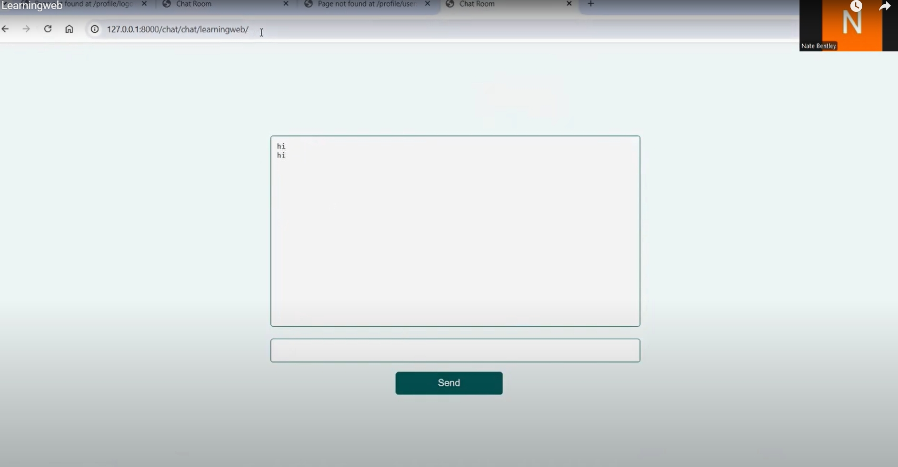

# Final Website Video
https://www.youtube.com/watch?v=jLKgWnpcOqc

# Summary
This website combines two different website ideas, that of a social media app, and also a course learning platform. It uses Django/Python to build the website and create endpoints, and a PostgreSQL database for the backend. 
The front-end is then a simple html and css layout with bootstrap.

# Registration

  
  
  
  

The entry screen begins with the index page that renders links to the different parts of the site, then there is the login page that handles the login, validating the inputs from the user. If successful the user gets logged in and gets sent to their profile page. 

If not, an error message is displayed. The Register part uses a view ‘register’ to add forms to be validated and then the account is confirmed.
The user can log out in most parts of the app, which directs them back to the homepage.

To test these items, I wanted to verify the functionality of the login system with UserLoginTests. This contains tests for successful login, and making sure the user is redirected to their profile page upon login. It check that incorrect login details return an error message and  additionally, it makes sure that the login form is correctly displayed on a GET request and verifies authentication after login. THe register view tests make sure that the registration process works correctly. The tests make sure that users can successfully register, that their passwords are correctly hashed ,and that the profile is created and linked to the user.

# Student Functionality

## Student Homepage

  

The user_courses_api retrieves a list of courses that a user is enrolled in. This is done either by using their username or by pulling the authenticated user’s data. It filters the CourseStudents model to find the user's enrollments and returns the data in a serialized way. The UserCoursesApiTests (APITestCase) class is all about testing this endpoint. It checks if the endpoint correctly returns an empty list when the user has no enrolled courses (test_get_user_courses_empty). It also makes sure that if someone tries to access courses for a user who doesn’t exist, a 404 error is returned (test_get_user_courses_invalid_user).

The courses_not_enrolled_api fetches a list of courses that the user isn’t enrolled in. It compares all available courses with the user’s current enrollments and returns a list of courses they are not enrolled in.
### Enroll On Course
The enroll_student_api lets an authenticated student enroll in a course. If the student is already enrolled, an error message will be returned. If the student isn’t enrolled, the system creates an entry in the CourseStudents model and moves the user to the course detail page.
### Updating Status

## View Course

  

The course_detail_view is used to fetch and display details about a specific course. It calls an external API to get the data, and if everything goes well, the course data is displayed on the course detail page.

### Giving Feedback
Submit_feedback_api allows a student to submit feedback for a course. It checks the course ID, collects the feedback data, and saves it to the Feedback model if the data is valid. If the data doesn’t pass validation, an error is returned.

# Staff Functionality

## Staff Homepage

  

For the teacher_courses_api it fetches all the courses taught by the authenticated teacher. It first checks if the user has the “Teacher” role, and if they do, it returns a list of courses associated with that teacher.

## Find Other Users

  

For the views, user_list is used to display a list of all the users in the system, except for the currently logged-in user. This makes it easy to interact with other users. course_detail_view is used to fetch and display the details of a specific course. It calls an external API, and if the request goes smoothly, the course data is shown on the course detail page.

## View Other Users Profiles

  
  

## View Course

  

The course_detail_view is used to fetch and display details about a specific course. It calls an external API to get the data, and if everything goes well, the course data is displayed on the course detail page.

## View Enrolled Students

  

The enrolled_students_view shows a list of students who are enrolled in a specific course. This is fetched via an external API, and the student data is displayed on the page. The EnrolledStudentsViewTests tests check that the list of enrolled students is displayed correctly when there are students in the course. It also makes sure that non-logged-in users are redirected to the login page if they try to access the list, and it tests how the system behaves if there are no students enrolled in a course.

### Remove Them From Course

‘Remove_student_from_course’ allows a teacher to remove a student from a course. It deletes the student’s record from the CourseStudents model, and then redirects the user back to the course detail page. The RemoveStudentFromCourseTests tests checks that unauthenticated users are properly redirected to the login page if they try to remove a student from a course.

## Edit Course

  

For the edit_course_api, this allows a teacher to update a specific course’s details—things like the name, description, and image. The course is fetched by its ID, and then the teacher can make the updates, which are processed using a serializer.
The ‘EditCoursePageTests’ tests, test this page and makes sure that teachers can access and edit their courses. It also checks that students are blocked from editing courses and receive a 404 error if they try to access the page.

## Add Content To Course

  

‘Add_week_content_api’ lets a teacher add content (like a title and PDF) to a specific week in the course. If the required fields are provided, it creates the content and returns the serialized data for the new content.

## Add Week To Course

  

Then we have add_week_api, which lets a teacher add a new week to a course. The week’s details, like the number and dates, are validated. If there’s no duplicate, the new week is added and serialized for the response. 

Add_week_page lets a teacher add a new week to a course through a form. Once the week is validated, it’s saved, and the teacher is returned back to the course detail page. Lastly, add_week_content allows a teacher to add content (like a title and a file) to a specific week in the course. After the form is filled out and validated, the content is saved, and the teacher is returned to the course detail page.

## Create A New Course

  

‘Create_course’  allows teachers to create new courses. Before this, it checks if the user has the right role (i.e., they are a teacher) and validates their profile. If correct, the course gets created using a serializer. If the user isn’t a teacher or if the data is invalid, an error is shown. The test class CreateCoursePageTests (TestCase) makes sure only teachers can access this page. It checks that non-teachers are redirected to their profile page when they try to get to the course creation page. Separately, it makes sure that teachers can access the page and interact with the form to create a course.

Then there’s create_course_page, which allows teachers to create a new course. After filling out the form, the course is saved, and the teacher is redirected to the course detail page. edit_course_page is similar, but this time it lets a teacher edit an existing course’s details. After submitting the form with valid data, the course gets updated, and the teacher is redirected to their profile. 

# Chat Channels

  

I implemented the chat feature using channels, and redis it so that it was being called as an overall website feature that anyone can join on their profile, and also I added it in so that each respective course could have their own chat feature. 
